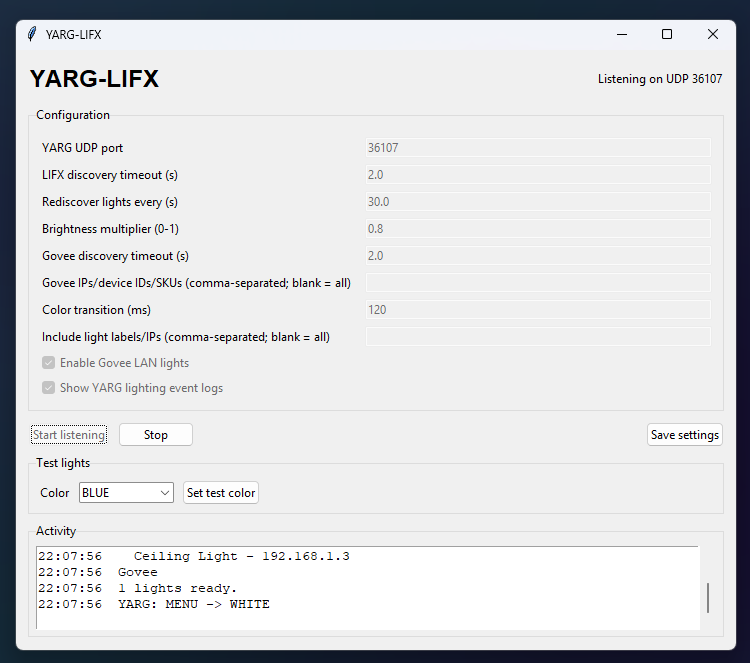

# Yet Another Lighting Controller, Simplified

## What is it?
datastream and controls LIFX & Govee lights using the LAN protocol. The app is
entirely made with AI but has been tested on all my LIFX lights to
work pretty well, as well as being tested with a Govee UDP emulator script. 
This app is meant to replace YALCY since its LIFX support is seriously lacking,
specifically the requirement for each zone to either be red, green, or blue.

## Supported Devices
- Any LIFX light ([Models](https://www.lifx.com/collections/all))
  - Must be connected to the same network and have full RGB support. Tested and functional with LIFX 15" Ceiling.
  - Polychrome zones are not supported, whole light only.
- A Govee light that has LAN support ([Models](https://app-h5.govee.com/user-manual/wlan-guide))
  - If the device isn't listed there, your model is either cloud-only or Bluetooth only. Neither are supported.
- Compatible Smart Life / Tuya Wi-Fi lighting products
  - Only devices advertised as lights with locally supported controls and a TinyTuya-recognized datapoint layout are enabled.

## Run from source

Install Python 3.10 or newer. On Debian/Ubuntu, install Tkinter if your Python
installation does not include it (`sudo apt install python3-tk`). From this
folder, create and activate a virtual environment:

```bash
python3 -m venv .venv-linux
source .venv-linux/bin/activate
python -m pip install -r requirements.txt
python main.py
```

On Windows, use PowerShell:

```powershell
py -m venv .venv-yarg-lifx
.\.venv-yarg-lifx\Scripts\Activate.ps1
python -m pip install -r requirements.txt
python main.py
```

The main window provides **Settings**, **Manage Lights**, and **Devices**
pop-outs. Settings contains the YARG port, discovery timeouts, brightness,
transition time, optional included bulbs, Govee filtering, and event logging.
The app scans once on launch; use **Scan lights** in Manage Lights to manually
refresh discovered devices. Manage Lights also lets you exclude lights or
identify one with a brief flash. Devices enables/disables LIFX, Govee, and
Smart Life / Tuya, links a Smart Life account, and lets you add LIFX/Govee
devices manually (both require a name and IP; LIFX also requires its MAC
address). Settings are saved to
`%APPDATA%\YARG-LIFX\settings.json` on Windows, or
`${XDG_CONFIG_HOME:-~/.config}/YARG-LIFX/settings.json` on Linux. Click **Start listening** after enabling
YARG's **UDP data stream** option. Use **Test lights** to set included lights
to a chosen color. **Rate limit tester** opens a separate window to select a
discovered light, preview a changing color sequence as commands are sent, and
set the selected light's maximum updates per second. Manage Lights also has a
per-light rate field. A blank Tuya field uses the default Tuya limit from
Settings; blank LIFX/Govee fields mean no rate limit. Explicit per-light limits
are supported for all providers. Stop YARG listening before running the rate
test. Activity logs confirm when the first valid YARG datagram arrives and
report malformed packets. Settings and provider
controls are locked while the listener is running; stop it before changing
them, then restart to apply the changes.

## Govee LAN Control setup

Enable **LAN Control** for each compatible Wi-Fi device in the Govee Home app
under **Devices → (device) → Settings/More Settings → LAN Control**. Govee
devices without LAN API support or with that setting disabled will not respond
to discovery. Allow YARG-LIFX through your firewall for local network traffic
if discovery or UDP reception is blocked.

The app sends the documented discovery JSON to multicast
`239.255.255.250:4001`, listens for responses on UDP `4002`, and sends commands
to each discovered device at UDP `4003`. It controls every discovered Govee
device by default. The **Devices** pop-out enables or disables Govee; the
**Settings** pop-out contains the discovery timeout and optional
comma-separated IP/device-ID/SKU filter. No API key, cloud connection, MQTT,
or additional Govee Python package is used.

## Smart Life / Tuya setup

1. Start YARG-LIFX and open **Devices** → **Connect / refresh**, or run
   `python main.py --tuya-login` from a terminal.
2. Enter the Smart Life **User Code** from **Me → Settings → Account and
   Security → User Code**.
3. Scan the displayed QR code in Smart Life (**+ → Scan**) and approve the
   authorization.
4. The app retrieves device metadata and local keys for devices the account
   advertises as locally controllable lights. Non-light products and lights
   without a verified TinyTuya datapoint mapping are skipped.
5. The app stores the supported device credentials in
`%APPDATA%\YARG-LIFX\tuya_devices.json` on Windows, or
`${XDG_CONFIG_HOME:-~/.config}/YARG-LIFX/tuya_devices.json` on Linux. This file contains
   sensitive local keys; it is kept outside the repository and should not be
   shared. Tuya credentials are separate from the normal settings file.

The QR authorization and device-credential retrieval use the Tuya
[Device Sharing SDK](https://github.com/tuya/tuya-device-sharing-sdk); the
Smart Life user-code/QR flow is also documented by
[tuya-local-key](https://github.com/vineetchoudhary/tuya-local-key). No Tuya
developer project or manually extracted local key is required.

**Internet/Tuya cloud is used during QR onboarding or an explicit credential
refresh only. Normal startup discovers cached devices on the LAN, and YARG
lighting commands are sent locally with TinyTuya; the gameplay path does not
use the Tuya cloud.** TinyTuya detects and validates the local bulb datapoint
layout before the app enables control. Unsupported layouts are skipped rather
than receiving guessed datapoints. Tuya commands run on a worker, duplicate
states are cached, and **Settings** lets you cap updates per second (default
10).

Changing, resetting, or re-pairing a Tuya device may invalidate its local key.
Use **Devices → Connect / refresh** or `python main.py --tuya-refresh` to
reauthorize and replace the cached device data. To remove only the Tuya data,
run `python main.py --tuya-logout`.

Allow the app through your operating system's firewall on your private LAN if
UDP or LIFX discovery is blocked.

## Build a standalone executable

From PowerShell, create the build environment and run the build script:

```powershell
py -m venv .venv-yarg-lifx
.\.venv-yarg-lifx\Scripts\Activate.ps1
python -m pip install -r requirements-build.txt
.\build.ps1
```

The one-file, windowed executable is `dist\YALCS-0.2.1.exe`. Copy it anywhere and
run it; per-user settings remain in AppData. The executable has no console
window. Windows may ask you to allow local network access the first time it
runs.

### Linux executable

PyInstaller builds for the operating system it is running on; build the Linux
binary on Linux, not on Windows. On Debian/Ubuntu, install Python, venv, and
Tkinter first:

```bash
sudo apt update
sudo apt install -y python3 python3-venv python3-tk
bash build_linux.sh
```

The script creates `.venv-linux`, installs the build requirements, and writes
the standalone GUI executable to `dist/YALCS-0.2.1`. Copy it to a Linux system
with compatible system libraries and run it. Settings and cached Smart Life
local credentials use `$XDG_CONFIG_HOME/YARG-LIFX` when configured, otherwise
`~/.config/YARG-LIFX`. Allow local UDP traffic in the Linux firewall if YARG
datagrams or light discovery are blocked.

For command-line use from source:

```powershell
python main.py --test       # discover lights and set them blue once
python main.py --headless   # listen without opening the window; Ctrl+C stops
python main.py --tuya-login # link or refresh Smart Life credentials
python main.py --tuya-logout # delete only cached Smart Life credentials
```

## Lighting

YARG sends enum values for the current lighting cue, section, and strobe state;
it does not send RGB values. The app maps Verse to blue, Chorus to yellow, and
other cue families to practical colors, turns lights off for blackout cues, and
uses timed on/off pulses for strobe. Each enabled provider receives the same
internal lighting intent. LIFX uses its color transition command; Govee uses
its local `colorwc`, `brightness`, and `turn` messages; Tuya uses TinyTuya's
local bulb interface. Commands run outside the UDP receiver, with cached
per-device state to avoid identical commands.

## Protocol references

- [YARG DataStreamController](https://github.com/YARC-Official/YARG/blob/master/Assets/Script/Integration/Data%20Stream/DataStreamController.cs):
  UDP destination, header, version, and field serialization.
- [YARG.Core LightingEvent.cs](https://github.com/YARC-Official/YARG.Core/blob/master/YARG.Core/Chart/Venue/LightingEvent.cs):
  authoritative cue enum values.
- [YALCY UDP intake](https://github.com/YARC-Official/YALCY/blob/master/YALCY/Udp/UdpIntake.cs)
  and [byte descriptions](https://github.com/YARC-Official/YALCY/blob/master/YALCY/Udp/UdpIntake.Enums.cs):
  extended datagram layouts and enum descriptions.
- [Govee LAN Control user guide](https://app-h5.govee.com/user-manual/wlan-guide):
  vendor instructions for enabling LAN Control.
- [Govee LAN protocol documentation](https://github.com/egold555/Govee-Reverse-Engineering/blob/master/Products/H619D.md):
  discovery ports, response fields, and `turn`, `brightness`, `colorwc`, and
  color-temperature command payloads. Device support varies by model.
- [govee-lan Python library](https://github.com/blakete/govee-lan):
  maintained implementation cross-checking the multicast scan and command
  formats. YARG-LIFX uses the small JSON LAN protocol directly to avoid
  additional dependencies and subnet sweeps.
- [LIFX LAN protocol](https://lan.developer.lifx.com/) is used by
  `lifxlan`; no cloud API or token is required.
